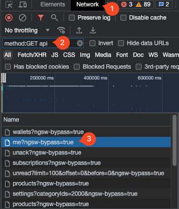
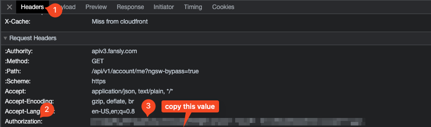

# Fansly Stream Recorder

This script allows you to record fansly streams live to a .mp4 file and allows automatically uploading the VOD to a cloud service using rclone, and uses discord webhooks to keep you updated on the status(stream start/file conversion/upload).

⚠ This is currently under development, everything is still being planned out and tested. Feel free to use and create any issues to help with the development of it.

> Thanks to the guys working on [Fansly downloader](https://github.com/Avnsx/fansly-downloader) for the new headers used here :).
### Table of Contents
<details>
  <summary>Click to expand!</summary>
  
  * [Requirements](#requirements)
  * [Setting up](#setting-up)
     * [Getting Account Token](#getting-fansly-account-token)
   * [Running](#running)
   * [Disclaimer](#super-serious-and-needed-disclaimer)
   * [Troubleshoot](#troubleshoot)
      * [Hanging on start](#hanging-on-start)
</details>


# Requirements

- [python](https://www.python.org/downloads/) - 3.10 or higher (latest should be fine, add to PATH).
- [ffmpeg](https://ffmpeg.org/) - [adding to path](https://phoenixnap.com/kb/ffmpeg-windows) on windows*.
- [rclone](https://rclone.org/downloads/)
- [python-rclone](https://github.com/ddragosd/python-rclone)
- [mt](https://github.com/mutschler/mt) - thumbnail sheet generator (the script uses prebuilt binaries from the repo, download and place in the same folder as the script.)
- [tmux](https://github.com/tmux/tmux/wiki) - terminal multiplexer, allows you to keep a process running without having to have the terminal window for it open.
- [mprocs](https://github.com/pvolok/mprocs) - run multiple commands in parallel, useful if you have multiple models you want to monitor and record.

*Alternatively on windows, you can install [chocolatey](https://chocolatey.org/install) to install some of the required programs. 

# Setting up

1. Install required python modules for the script:

```
pip install -r requirements.txt  

# Or use a virtual environment for all the requirements. 
# You will have to run the source command everytime you go to the directory in a new terminal to be able to run it
   
python3 - m venv .venv
source .venv/bin/activate
pip install -r requirements.txt
```
2. Edit `config.py` to add your fansly [account token](#getting-fansly-aount-token) and configure what you want enabled.

3. Install and create a rclone remote (`rclone config`) if you don't already have one and then edit `fansly-recorder.py` and add the following:

   - The rclone config `cat $HOME/.config/rclone/rclone.conf` for the host you want to push the files to
   - The remote path to `rcloneRemotePath`

Example:

```
rcloneConfig = """
[remote]
type = drive
scope = drive
token = {"access_token":"......."...}
"""
rcloneRemotePath = "remote:path/to/FanslyVods/"
```

## Getting Fansly Account Token

1. go to [fansly](https://fansly.om) and login and open devtools.

2. In network request, type `method:GET api` and refresh and click on one of the request

3. Look under `Request Headers` and look for `Authorization:` and copy the value

<p align="center">
<p align="center">

Alternatively:

Instead of clicking Network tab, go to Storage -> Local Storage -> https://fansly.com -> session_active_session and copy your token from there.

# Running

The script will continue to loop and check for the model to be live every 2 minutes and 10 seconds and then start to record, once finished it will push the file to the remote and go back to checking for the model to be live again.


Run the script:

```
python3 fansly-recorder.py {username}
```

Recommended to run the script in tmux to be able to close the terminal session.

Create a new tmux session:

```
tmux new -s Fansly
```

Again run the script:

```
python fansly-recorder.py {username}
```

Or edit the mprocs.yaml file with the models you want to monitor and simply run:


```
mprocs
```
⚠ Some processes may not startup correctly, so you may need to press `s` over the processes that say down several times until they go up.


press `ctrl + b` then `d` to detach from the session.

Alternatively, you can use the `start.sh` script to create the tmux instances and run the script:
*I didn't update this to work with the mprocs tool at this time*

```
bash start.sh {username}
```

[more on tmux](https://www.hamvocke.com/blog/a-quick-and-easy-guide-to-tmux/)

# Troubleshoot

### Hanging on start
If running locally, you may expierince hanging of the script. To get around this you'll need to edit `fansly-recorder.py` a bit. Under the `getAccountData` and `getStreamData` functions, you'll want to change the following line:


```python
async with aiohttp.ClientSession(connector=connector, headers=config.headers) as session:
```
to the following:
```python
async with aiohttp.ClientSession(headers=config.headers) as session:
```

# Super Serious And Needed Disclaimer

> "Fansly" is operated by Select Media LLC 👺.
>
> This repository and the provided content in it isn't in any way affiliated with, sponsored by, or endorsed by Select Media LLC or "Fansly" 👺.
>
> The developer of this script is not responsible for the end users' actions 👺.
